### UNIVERSITY OF ZAGREB 

# Controlling a Swarm of Robots in a Simulator Stage using Reynolds’ Rules

### Joseph Adeola, Khawaja Ghulam Alamdar, Moses Ebere, Nada Elsayed Abbas

![ref1] ✦ ![ref1]

1  **MOTIVATION**

This project focuses on implementing and evaluating Craig Reynolds’ behavioral rules—separation, alignment, and cohesion—within a Robot Operating System (ROS) framework and the Stage simulator. The project aims to en- hance the capabilities of robotic swarms by adding Naviga- tion and Obstacle Avoidance behaviors to allow the swarm to move towards specific points and stop, while Obstacle Avoidance enables them to detect and evade obstacles, thus preventing collisions. The robots are tested in various scenarios to assess their collective behavior, adaptability, and robustness. This project combines theoretical concepts with practical application, shedding light on the dynamics of robotic swarms and their potential in simulated environ- ments. Video results are provided to illustrate the findings. [here ](https://www.youtube.com/playlist?list=PLEhDw-EN_WqGiUwWmusO_4fW-CWt7HmLE)and [here.](https://www.youtube.com/playlist?list=PL_eKUkXsvo0Y0a8hcg0ggh9Zck--EYpBf)

2  **METHODOLOGY**
1. **Reynolds’ Basic Behaviors**

- 1\. **Cohesion**: Cohesion encourages boids to move towards the average position of neighboring boids within a defined spatial range.  
- 2\. **Separation**: Separation aims to avoid collisions steering boids away from nearby boids within a specified neighborhood

- 3\. **Alignment**: Alignment aligns the heading direction of a boid with the average heading direction of its neighbors.

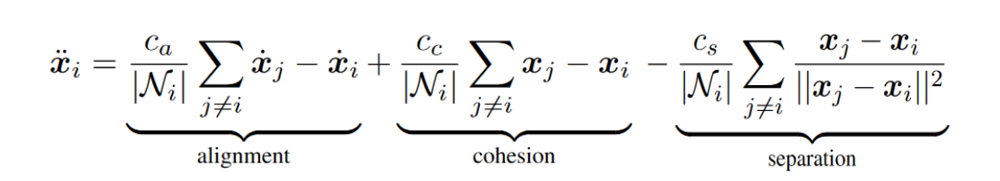

2. **Local Neighborhood**

based on spatial proximity and directional alignment. 

  
  

3. **Obstacle Avoidance**
- Potential Field

The Brushfire algorithm creates a potential function around obstacles, assigning grid cell values based on their distance to obstacles, with potential increasing near obstacles and decreasing with distance. This potential guides a boid to avoid obstacles. The algorithm also determines the repulsion direction as a vector, scaling its magnitude based on cell proximity to obstacles, utilizing the gradient for direction and the brushfire output for proximity.

  
  

- Steer to Avoid
The steer-to-avoid method adjusts an object's orientation to navigate around obstacles, exploring paths by incrementally changing orientation left and right, and assessing path validity. If a clear path is found, the orientation updates to follow it, repeating until a viable path is found or limits are reached. This method checks the entire path, not just the look-ahead point, to account for multiple force interferences and situations where the look-ahead point is outside map boundaries.

  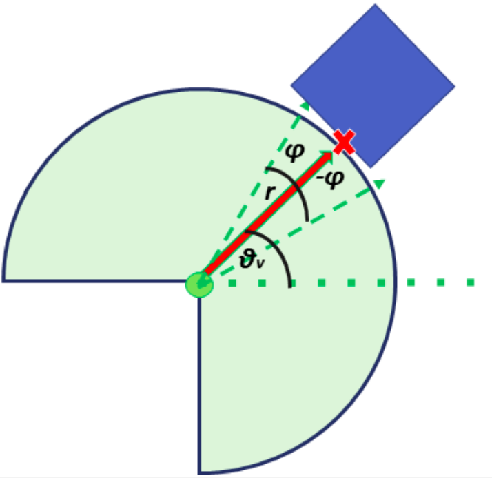
  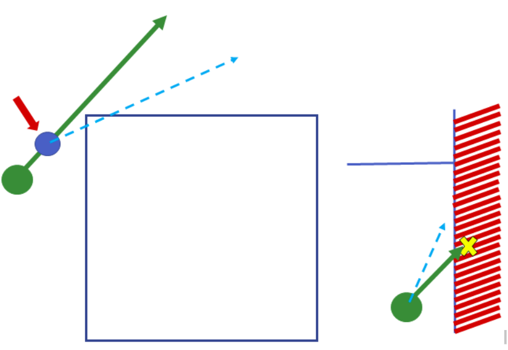

4. **Arrival**

The Arrival behavior, similar to Seek, directs the flock towards a target but incorporates slowing down as it nears the goal, ultimately stopping at the target location. This deceleration begins when entering a predefined slowing distance, with speed reducing from maximum to zero inside this radius. The process uses the hyperbolic tangent function (tanh) for smooth deceleration, ensuring the flock smoothly stops at the goal, with steering force also decreasing to zero as the target is approached.

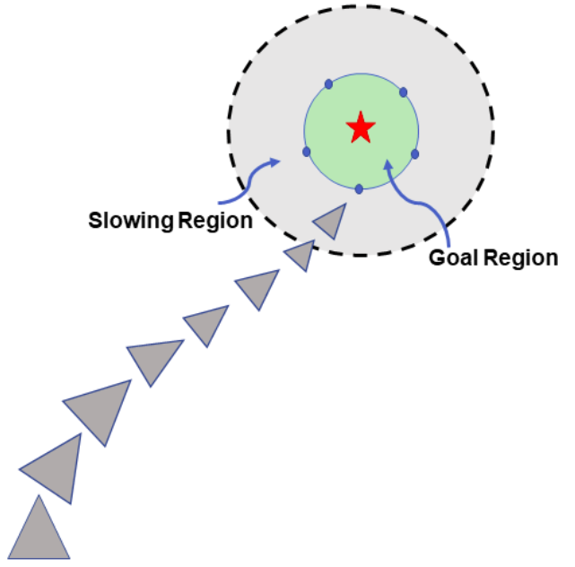

In our method, we conceptualize the goal as a circular area, centered at a designated point on the map, with a radius equal to the desired minimum separation distance. This circle serves as the target area for the flock. To effectively guide the flock, certain boids are selected as leaders. These leaders utilize the arrival steering force to steer the rest of the flock towards the goal, while the flock adheres to basic behavioral rules of separation, alignment, and cohesion. Leadership is assigned through the generation of several subgoals, corresponding to the number of desired leaders. These subgoals are equidistant points on the circumference of the target circle, spaced apart by a distance equal to the radius of the circle. This spacing aligns with the minimum desired separation distance between the boids.

We designed two methods for assigning leadership:

1) **Nearest Neighbors (NN):** Initially, the nearest boid to each subgoal is appointed as a leader. As the flock moves toward the goal and the formation changes, the leader for each subgoal is updated to be the closest boid.
1) **Convex Hull Method:** This approach considers only boids on the flock’s periphery, with clear vision, as potential leaders. After identifying all boundary boids, those nearest to the subgoals are selected as leaders. Leadership is dynamically adjusted as the flock advances.

A boid is considered to have reached its destination once it enters the target area or reaches its boundary. This marks the completion of the arrival process as per our algorithm.

  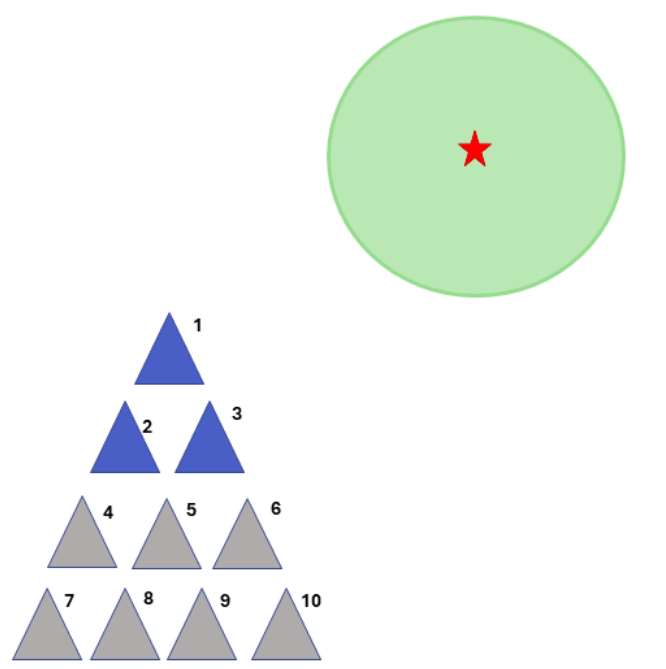
  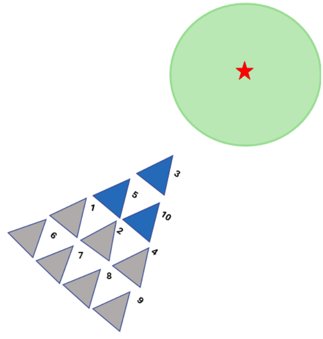
   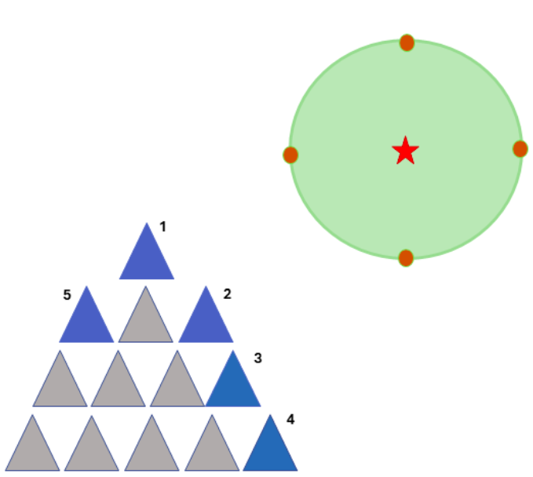

1) Nearest Neighbours
2) Dynamic Leader Selection
3) Convex Hull

6. **Prioritized Acceleration Allocation**

Prioritized acceleration allocation uses a hierarchy to assign accelerations to behaviors based on their importance, adjusting for scenario changes. Acceleration is given according to a priority list, stopping when reaching the boid's maximum limit—if exceeded, the last behavior's allocation is reduced. This system prioritizes critical behaviors, like obstacle avoidance, over less critical ones, such as flock cohesion.

 
3  **SYSTEM ARCHITECTURE**

4  **RESULTS AND DISCUSSION**

1. **Preliminary Behaviors and Navigation**

Within the context of this simulation project, the developed algorithms were sufficiently tested in 6 map environments. These tests were run with different behavior combinations and parameter settings to ascertain the performance of algorithms. In this subsection, we examine some simulation results.

 

|**Run**|**Alignment**|**Cohesion**|**Separation**|
| - | - | - | - |
|a|✓|×|×|
|b|×|✓|×|
|c|×|×|✓|

TABLE 1: Simulation with Isolated Behaviors (for fig. 14)

The basic behaviors of separation, alignment, and cohesion were tested individually in a "map with a frame." The tests showed that separation and cohesion work in opposing directions, with separation moving a boid away from its neighbors, while cohesion could lead to collisions if it acts alone. Alignment focuses on maintaining the same velocity as neighboring boids. When combined, these behaviors lead to a formation that balances the influences of each behavior, ensuring the boids converge into a coherent group.

  
  
   

Fig. 14: Testing Basic Behaviors in an Empty Map. (cont.) Boids are shown with blue dots and perceptive fields of view with transparent green circles.

  
  
   

2) Local Migratory Urge Convergence

Under a local migratory urge, the leading boids will reach and stop at the goal while the followers will aggregate around the leaders. When all boids are equally influenced by the goal, they all compete to converge as close to the goal as possible. See figure 

   

2. **Comparative Analysis**
1. Potential field vs Steer-To-avoid

The two approaches considered for obstacle avoidance ex- hibit differing levels of effectiveness. Although the potential field method offers the advantage of low computational complexity, it is only because it is computed once assuming the map is known. For a real robot, the potential field is locally computed making it computationally expensive online. Adding to this, the potential field falls short in overall performance compared to the steer-to-avoid strategy. This discrepancy primarily arises from inherent corner cases that can emerge with a repulsive field.

The figures illustrate the trajectory of a boid in a specific start-goal configuration within linear and circular environments, respectively. In both scenarios, steer-to-avoid adeptly guides the boid around the obstacle. However, the potential field method requires closer scrutiny.

  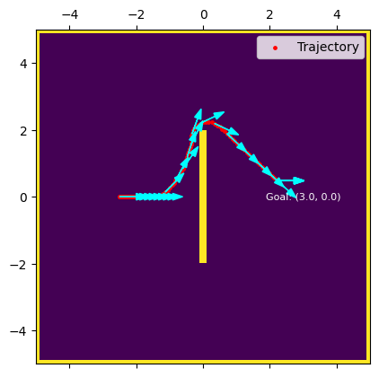
  
    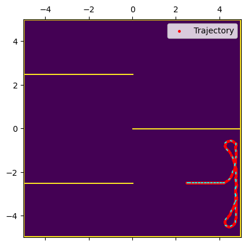

1) Steer to Avoid

  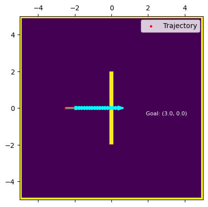
  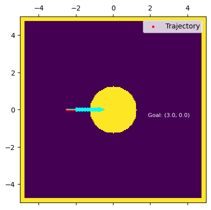

2) Potential Field

In the potential field approach, a boid experiences a repulsive force from an obstacle that acts against the attractive force towards a goal. This interaction can lead to two outcomes: if the attractive force is stronger, the boid oscillates near the obstacle's boundary due to being repelled and then re-attracted. If the repulsive force is weaker, the boid slows down and may collide with the obstacle. In cases where the goal is beyond the map's border, the boid can avoid collisions using the steer-to-avoid method, effectively navigating along walls. The steer-to-avoid method, which guides the boid alongside obstacles rather than just repelling it, is identified as the superior obstacle avoidance algorithm due to its effectiveness in preventing collisions and handling boundary scenarios.

2. Weighted Acceleration vs. Prioritized Acceleration Accumulation

The weighted average method combines accelerations from various behaviors into a single force, which is simple but can lead to conflicts where forces cancel each other out. The prioritized acceleration accumulation (PAA) method addresses this by ranking acceleration requests by importance, allowing critical responses to prevail without interference from lesser forces. While scalable and better for analysis, PAA's drawback is its context-specific prioritization and the challenge of reallocating priorities in complex environments. The effectiveness of PAA can be seen in the report's accompanying videos.

3. **Multi-goal Aggregation**

The multi-goal arrival strategy guides the flock through multiple predetermined goals sequentially, transitioning to the next goal when a specificpercentage of the flockreaches the current one. This adjustable percentage ensures orderly movement across the map, with the flock’s trajectory illus- trated as it moves between goals.

   
   
   
   
   

1) Migration to the First Goal
2) Aggregation at the First Goal
3) Arrival at the Second Goal
4) Migration to the Third Goal
5) Aggregation at the Third Goal 

4. **Parameters Tuning**

1. **Effect of Angle Incremental of Steer-to-avoid**
   - In environments with long, straight obstacles, larger angle increments (e.g., 25 degrees) facilitate rapid turning and effective avoidance, while smaller increments enable smoother navigation in cluttered spaces with small obstacles, resembling birds' agile movements.

2. **Effect of Local Neighborhood’s Field of View**
   - Adjusting the FoV angle to less than 360° biases boid interactions towards the front, simulating birds’ limited vision. This modification influences flock cohesion, where a 360° FoV leads to circular or elliptical movements, and a narrower FoV results in more streamlined, bird-like flocking behavior.

3. **Parameter Tuning for Combined Behaviors in Different Map Environments**
   - Tuning for boid behaviors prioritizes obstacle avoidance, separation, alignment, and cohesion to enhance flock cohesion in varied environments. Obstacle avoidance is emphasized for smooth flocking, with separation next to prevent collisions. Alignment weight is reduced to facilitate maneuvering around obstacles, particularly in crowded or complex spaces. Arrival behavior is least prioritized to prevent conflicts with obstacle avoidance, with priorities informed by extensive testing across different environments.

  
  

1) 360° FoV
2) 135° FoV

|**Fig.**|walign|wcohere|wseparate|wsteer|warrive|**Priority**|
| - | - | - | - | - | - | - |
|[23a](#_page9_x48.00_y47.67)|0\.1|0\.2|0\.2|0\.85|0\.0|St>S>A>C|
|[23b](#_page9_x48.00_y47.67)|0\.0|0\.35|0\.2|0\.85|0\.1|Ar>St>S>A>C|
|[23c](#_page9_x48.00_y47.67)|0\.1|0\.2|0\.2|0\.85|0\.0|St>S>A>C|
|[23d](#_page9_x48.00_y47.67)|0\.1|0\.35|0\.2|0\.85|0\.1|Ar>St>S>A>C|
|[23e](#_page9_x48.00_y47.67)|0\.1|0\.2|0\.2|0\.85|0\.0|St>S>A>C|
|[23f](#_page9_x48.00_y47.67)|0\.0|0\.25|0\.2|0\.85|0\.1|Ar>St>S>A>C|

TABLE 2: Simulation with Combined Behaviors (for fig.23). Key: St - Steer-to-avoid; S - Separation; Ar - Arrival; A - Alignment; C - Cohesion.

|        | Figure (a) | Figure (c) | Figure (e) |
|--------|------------|------------|------------|
| Image  | 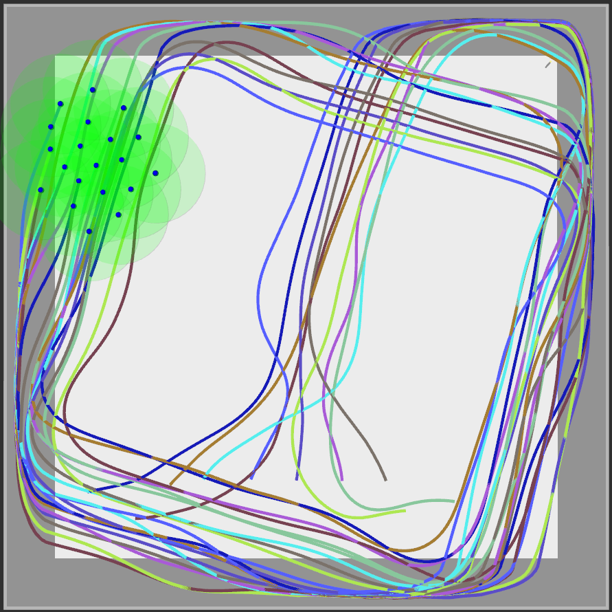 | 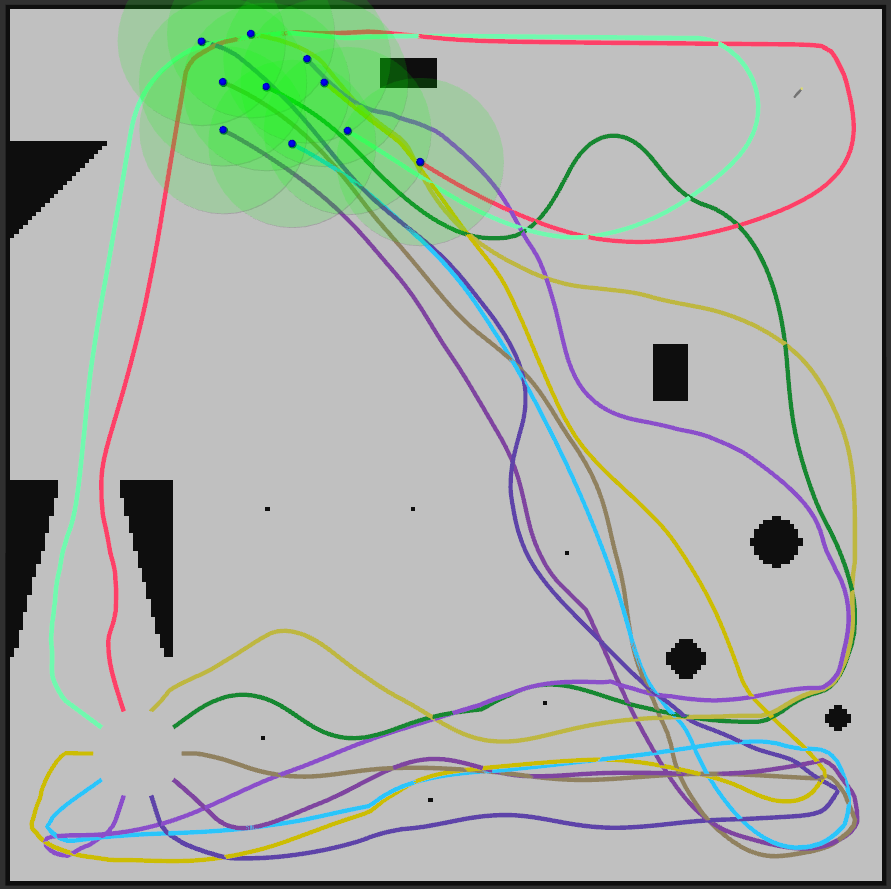 | 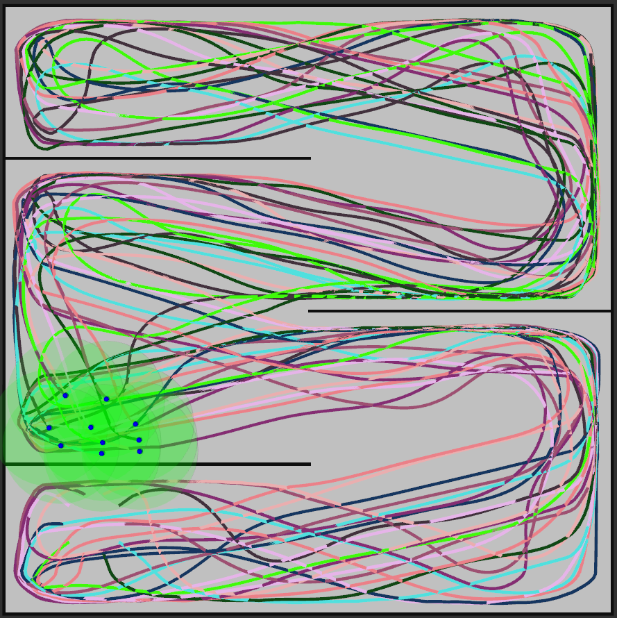 |
| Description | 20 Boids Flocking with Obstacle Avoidance: Requires precisely tuned parameters for fluid movements in corners for larger flocks. | 10 Boids Flocking with Obstacle Avoidance: Successful in avoiding obstacles of various shapes and sizes, capable of bifurcation and convergence. | 10 Boids Flocking with Obstacle Avoidance: Boids approach a corner from two directions due to bifurcation and subsequent convergence. |

|        | Figure (b) | Figure (d) | Figure (f) |
|--------|------------|------------|------------|
| Image  | 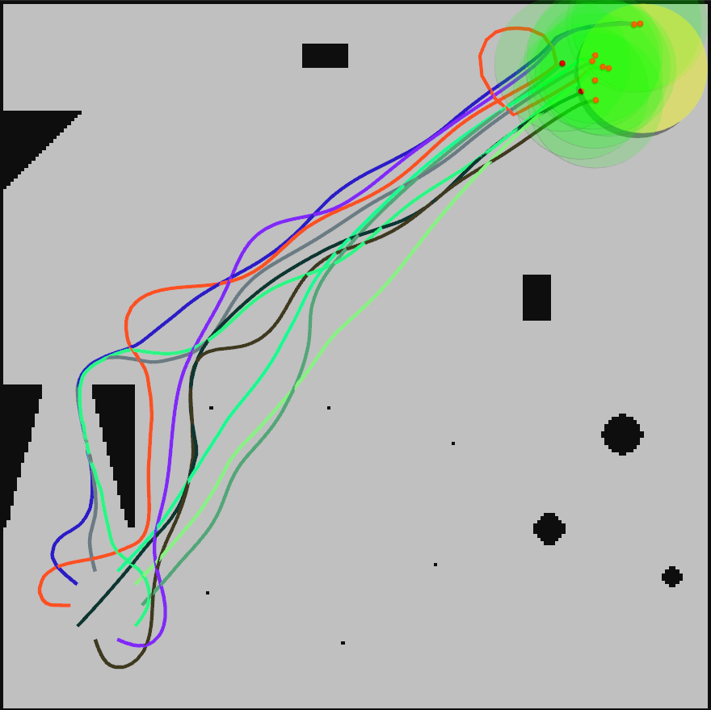 | 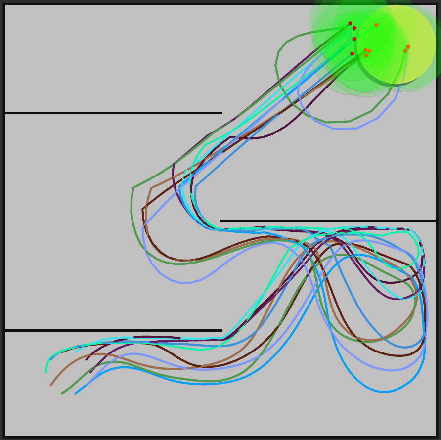 | 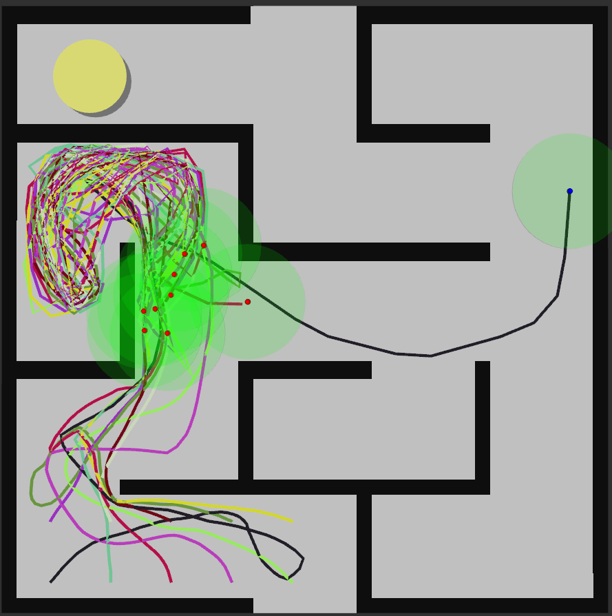 |
| Description | 10 Boids Migrate to a Set Goal while Avoiding Obstacles: Arrival at the set goal is always guaranteed with obstacles not being long stretches of walls. | 10 Boids Migrate to a Set Goal while Avoiding Obstacles: The arrival vector's effect is evident in the boids' trajectory towards the goal. | 10 Boids Migrate to a Set Goal while Avoiding Obstacles: In a hard maze map, boids flock within specific areas due to strong wall forces and the goal on the other side, indicating challenges in maze-like environments. |
